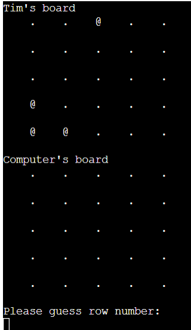
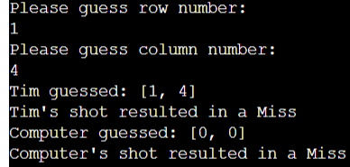

# BattleShip

BattleShip is a strategy guessing game for two players run through a mock up terminal. 
If the player or the computer is able to land four hits on its opponent ships through guessing coordinates on a grid, they win the game. 

## How to play

After entering your name, two boards will randomly generate. One is for the player and the other one for the computer. Your boats are indicated by the @ sign. The boats of your oppenent are not shown. You will pick a row number and column number between 0 and 4. The top left corner is [0, 0]. The player and computer will switch sides until one of them hits the four boats of their opponent. After the game you are able to restart the game or quit the app. Enjoy!

## Features

<ul> Intro screen
    <li> Welcoming message</li>
    <li> Explanation</li>
    <li> Input user name</li>
</ul>

<ul> Random board generation
    <li> Ships are placed randomly on each player's board.</li>
    <li> The player is unable to see where the ships of his opponent are.</li>
</ul>

<ul>
    <li>Able to play against computer.</li>
    <li>User able to input coordinates.</li>
</ul>

<ul> Input validation and error-checking
    <li> You can only enter a number.</li>
    <li> You can't hit the same spot twice.</li>
    <li> You can only enter a number inside the grid.</li>
</ul>

<ul>
    <li> Data is managed within the class instances.</li>
    <li> Able to restart the game or quit through input.</li>
</ul>

## Data model

The data model I used is a Board class. The game creates two instances of the Board class model to hold the player's and computer's board.
<ul> The Board stores:
    <li> number of ships</li>
    <li> board size</li>
    <li> board type</li>
    <li> player name</li>
    <li> position of ships</li>
    <li> guesses against each board</li>
</ul>

<ul> Board methods
    <li> add ship method</li>
    <li> add guess method</li>
    <li> print out current board</li>
</ul>

## Testing

I've tested this project by doing the following:
<ul>
    <li> Giving invalid inputs such as: input out of bound, entered same input twice and put in strings where numbers were expected.</li>
    <li> Tested the project in my own terminal and in the heroku app mock terminal.</li>
    <li> Pressed the code through the pep8 linter and encountered the pep8 E501 error</li>
</ul>

<strong>Bugs</strong>
<ul>
    <li> No bugs were found during any phase of this project</li>
</ul>

<strong>Validator testing</strong>
<ul>
    <li> pep8 E501 error occurred from line 181 till 189. This error states that your line of code is above 79 characters. I've tried to fix this but couldn't figure out how to shorten the line without breaking the functions of the code. This didn't affect the code and program itself so I decided to keep it like it is.</li>
</ul>

## Deployment

This project was deployed in Code Institute's mock terminal for Heroku.

<ul> Deployment steps
    <li> Fork or clone this repository.</li>
    <li> Create a new Heroku app for project.</li>
    <li> Add a config var with key: PORT and value: 8000.</li>
    <li> Setting buildbacks to pyhon and node.js in that order.</li>
    <li> Linking the new app to the project repository.</li>
    <li> Manually deployed the app by clicking the deploy branch button.</li>
</ul>

## Credits
<ul>
    <li> I've used some of the code shown in the portfolio project scope video. The code was reusable for my own project so instead of reinventing the wheel I used what was given.</li>
    <li> I've used the wikipedia for information about the Battleships game.</li>
    <li> Code Institute for the terminal deployment.</li>

